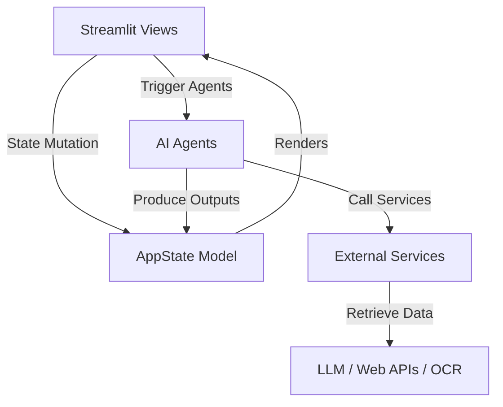

# System Architecture Document

## Design Principles
1. **Modular Separation**: UI resides purely in `src/views/`. Business logic and AI pipelines reside in `src/agents/` and `src/services/`.
2. **State Management**: Streamlit session state is bound to a validated Pydantic model (`AppState`) located in `src/models/state.py` to prevent state corruption across pages.
3. **Decoupled Integrations**: Any LLM, Search, OCR, or PDF writing tool relies on service interfaces in `src/services/`.

## Data Flow

